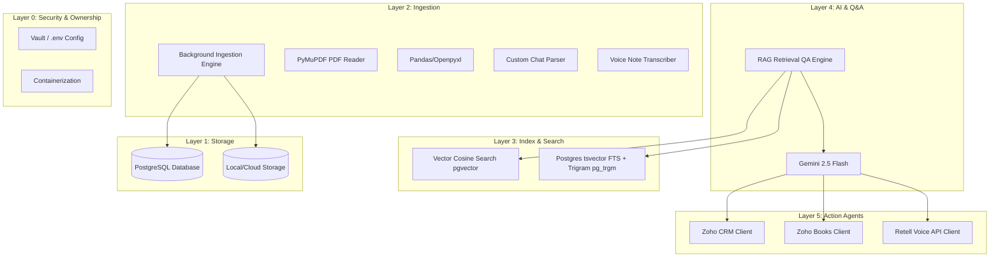
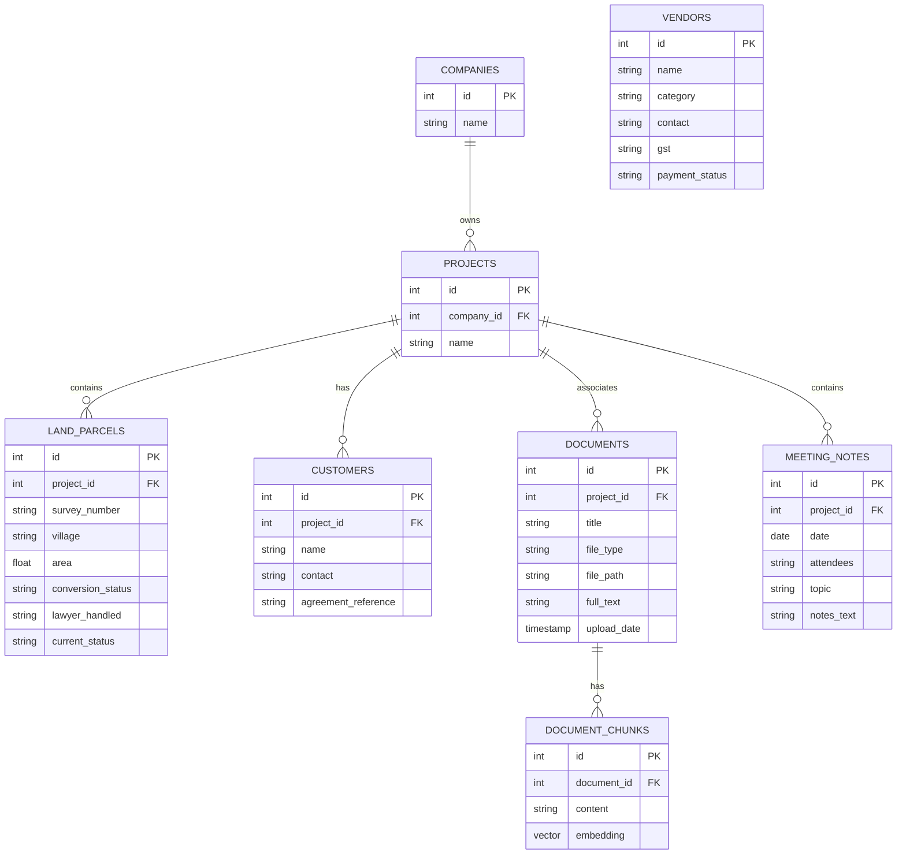

# System Architecture: The Company Brain

This document describes the design layers and data model of **The Company Brain**.

---

## The Six Architecture Layers

### Layer 5: Action Agents
Integrations with operational systems (Zoho CRM, Zoho Books, Retell). When a user asks live questions like *"How many leads came yesterday?"*, the LLM invokes function calling to fetch real-time facts instead of retrieving old documents.

### Layer 4: Ask in Plain English (AI Layer)
Receives natural language questions, coordinates with Layer 3 to query documents/records, builds prompts with a strict context-bound guardrail, and uses a Large Language Model (Gemini/Claude) to generate answers with inline source links.

### Layer 3: Index / Search
A hybrid search implementation combining **vector embeddings** (for semantic match) and **text keyword search** (for exact names, survey numbers, and IDs). 

### Layer 2: Ingestion
Asynchronous background pipeline parsing multiple file types (text PDFs, scanned documents, Excel sheets, WhatsApp chat exports, and audio recordings). Text is extracted, cleaned, chunked, embedded, and indexed.

### Layer 1: Storage
Stores structured records (projects, land records, vendors, customers, meeting notes) and unstructured files (original PDFs, voice clips, spreadsheets). Powered by PostgreSQL and Object Storage (or local folder fallback).

### Layer 0: Ownership & Security
Dockerized infrastructure, secrets management via environment variables, and ownership setups to prevent developer lock-in.

---

## Data Model (PostgreSQL)

